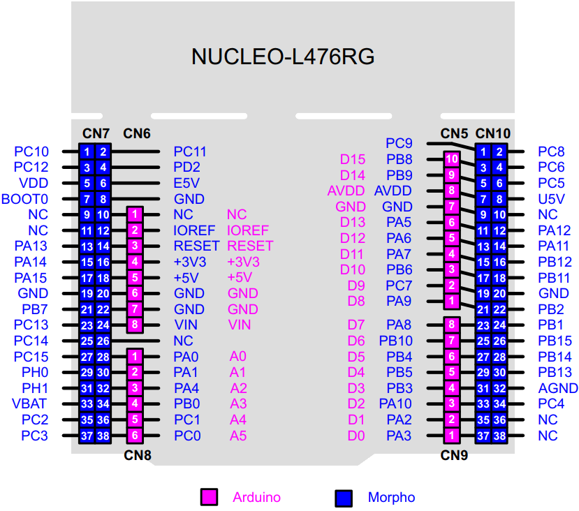
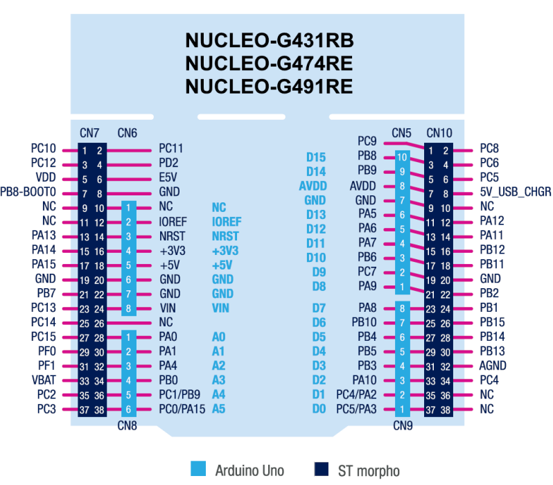
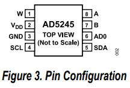

# Zoë2 Solar Power Management System

## Pinout Reference for Dev Boards

| Board             | **I2C**       |               | ‖ | **SPI**       |               |               |               | ‖ | **CAN**       |               |
|-------------------|---------------|---------------|---|---------------|---------------|---------------|---------------|---|---------------|---------------|
|                   | **SDA**       | **SCL**       | ‖ | **MISO**      | **MOSI**      | **SCLK**      | **CS**        | ‖ | **CANRX**     | **CANTX**     |
| Arduino Uno R3    | A4            | A5            | ‖ | 12            | 11            | 13            | 10            | ‖ | N/S           | N/S           |
| Arduino Mega 2560 | 20            | 21            | ‖ | 50            | 51            | 52            | 53            | ‖ | N/S           | N/S           |
| STM32L4 Nucleo    | PB7(CN7-21)   | PB6(CN10-17)  | ‖ | PC2(CN7-35)   | PC3(CN7-37)   | PB10(CN10-25) | PB15(CN10-26) | ‖ | PA11(CN10-14) | PA12(CN10-12) |
| STM32G4 Nucleo    | -             | -             | ‖ | -             | -             | -             | -             | ‖ | -             | -             |
| TEENSY 4.0        | -             | -             | ‖ | -             | -             | -             | -             | ‖ | -             | -             |

### <u>General Pinout Notes</u>
- Ensure there is a shared ground connection
- For SPI, the CS pin can be configured to any available GPIO pin in your code, I have used PB15 for STM32L4 for convenience
- Arduinos run at 5V logic levels, while STM32 and TEENSY 4.0 run at 3.3V. Ensure using level shifters if connecting 5V devices to 3.3V boards
- CAN bus requires additional hardware (CAN transceiver) for each board

### <u>STM32 L47RG Pinout Image</u>

### <u>STM32 G431RB Pinout Image</u>

## Pinout Reference for Digital Potentiometer (AD5245 chip)

|Pin Number |Mnemonic   |Description                            |
|-----------|-----------|---------------------------------------|
|1          |W          |Wiper Terminal                         |
|2          |VDD   |Positive Power Supply                  |
|3          |GND        |Digital Ground                         |
|4          |SCL        |Serial CLK, posedge triggered, pull up |
|5          |SDA        |Serial Data, pull up                   |
|6          |AD0        |Programmable Address, pull high or low |
|7          |B          |B Terminal                             |
|8          |A          |A Terminal                             |

### General Notes
- Logic levels are dictated by VDD. This means that teh chip can be run at either 3.3V or at 5V.
- AD0 <u>MUST</u> be pulled high or low in order for the chip to have an I2C address assigned to it.
    - If AD0 is pulled low, the address will be 0x2C
    - If AD0 is pulled high, the address will be 0x2D
- You will not see a resistance across any of the terminals while the chip is powered off.
- Arduino Library to control this chip exists here: [AD5245](https://github.com/RobTillaart/AD5245)
- Run I2C at standard 100 KHz just to ensure that the logic shift does not give problems.

### <u>AD5245 Pinout Image</u>
